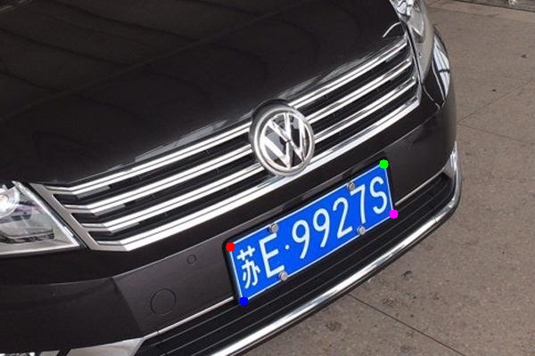
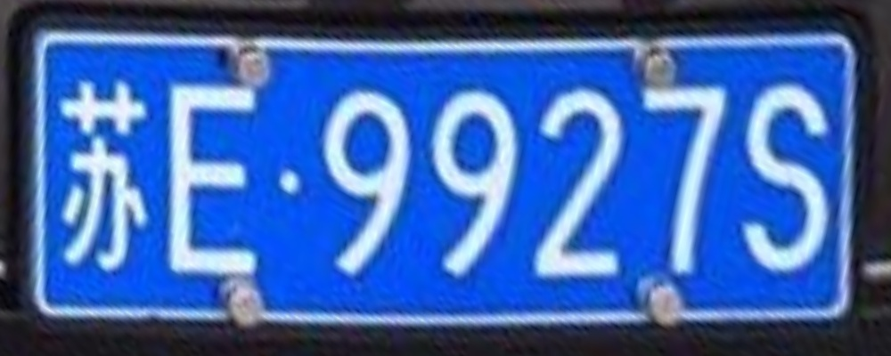

# 基于ResNet的关键点检测

## 项目简介

- 本项目实现对单一目标的关键点检测
- 主要用于检测矩形物体的四个角点，比如车牌、名片等
- 检测到四个角点的关键点后，可使用透视变换将图形矫正

## 环境构建

1. 创建虚拟环境

```bash
conda create -n keypoint python=3.7
conda activate keypoint
```

2. 安装cuda和cudnn

```bash
conda install cudatoolkit=10.2
conda install cudnn
```

3. 安装pytorch

```bash
pip install torch==1.7.0
pip install torchvision==0.8.0
```

4. 安装项目依赖的其他包

```bash
pip install -r requirements.txt
```

## 数据整理

1. 标注

- 使用`labelme`对目标的四个角点做关键点标注，得到`json`格式的标注文件

2. 数据集整理

- 按照如下格式存放数据，项目中存放了若干示例的图像和标签供参考

```bash
项目目录/data
└── car_plate  # 数据集名称
    ├── train
    |   ├── images  # 训练集图片
    |   └── labels  # 训练集标签，json格式标注文件
    └── val
        ├── images  # 验证集图片
        └── labels  # 验证集标签，json格式标注文件
```

## 训练

- 下载预训练权重

  链接：https://pan.baidu.com/s/1jooxbxQ8VR4fKQoX4jDtNQ 
  提取码：tl2c

  下载后，在项目目录下创建 `pretrained`目录，并放入预训练权重

- 启动训练

```bash
python train.py --batch-size 4 --epochs 500
```

- 出现如下日志，则训练正常

```bash
INFO: Namespace(batch_size=4, data_dir='./data/car_plate', epochs=500, heatmap_size=112, image_size=448, kpt_num=4, lr=0.001, model_save_dir='./model/', save_interval=50, sigma=3.0, weight_decay=0.0008)
Number of images in train: 2148
Number of images in val: 544
INFO: Using device cuda:0
INFO: Start training.
INFO: Epoch 1 start.
Train loss: 0.002156: 100%|███████████████████████████████████████████████| 537/537 [00:04<00:00,  5.32it/s]
INFO: Epoch: 1 train done, Loss: 0.002156, Accuracy: 19.9811%.
Test loss: 0.002241: 100%|████████████████████████████████████████████████| 136/136 [00:00<00:00,  8.16it/s]
INFO: Epoch: 1 valid done, Loss: 0.002241, Accuracy: 12.5000%.
```

- 可以通过 tensorboard 查看 loss 变化

```base
tensorboard --logdir model/
```

## 推理

- 启动推理

```bash
python inference.py
```

- 效果展示

|          关键点检测结果           |              图形矫正结果               |
| :-------------------------------: | :-------------------------------------: |
|  |  |

